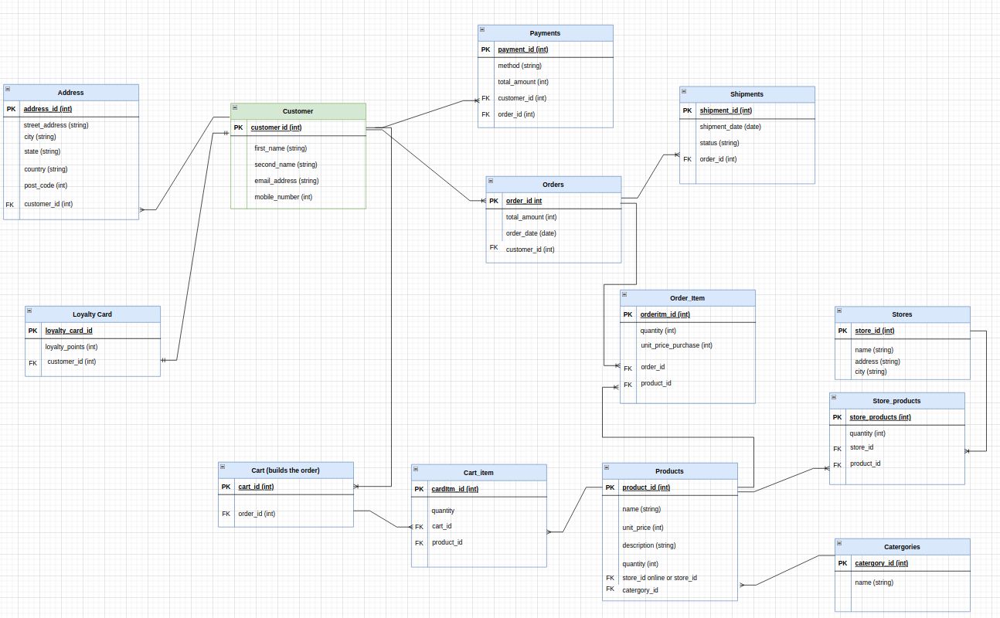

# JB HiFi Database Design 

## MVP

The task: 
- You are being tasked with recreating JB HiFi's database!
- Produce an ERD for this new database system and start playing around with `CREATE TABLE` statements and `INSERT` statements in SQL.

## My Approach

1. Create ERD to reflect JB HiFi's structure including in-store and online.
2. Normalize where possible to reduce redundant data.
3. Implement approach in MySQL.
4. Run basic queries to gather business insights.

## Entities
1. Customer
2. Address
3. Loyalty Card
4. Payments
5. Orders
6. Shipments
7. Cart
8. Cart Item
9. Product
10. Category
11. Store

## Data Relationships

1. **Products - Category**
    - Each product can belong to only one category.
    - A category can have many products.

2. **Order - Customer** 
    - Each order is placed by one customer.
    - A customer can place many orders.

3. **Customer - Address** 
   - Each address can have only one customer.
   - A customer can have many addresses.

4. **Shipments - Order** 
   - Each shipment corresponds to one order.
   - An order can have many shipment details.

5. **Product - Cart**
   - Each product can be added to many carts.
   - Each cart can have many products.

6. **Customer - Payment**
   - Each payment is made by one customer.
   - A customer can make many payments.

7. **Order - Products (via Cart)**
   - Each order can contain many products.
   - Products can be added to many orders.

8. **Cart - Order**
   - Each order is associated with one cart.
   - Each cart can only be finalized to one order.

9. **Customer - Loyalty Card**
   - Each customer can only have one loyalty card.
   - Each loyalty card belongs to one customer.

10. **Store : Products**
    - Each store can stock many products.
    - Products can be stocked in many stores.

### ERD

  
ERD diagram

  

### Relationships

- **1:M**
  - Category : Products
  - Customer : Orders
  - Customer : Addresses
  - Order : Shipments
  - Customer : Payments
  - Order : Products
  - Products : Stores

- **1:1**
  - Customer : Loyalty Card
  - Order : Cart

- **M:M**
  - Product : Cart (via Cart Item)
